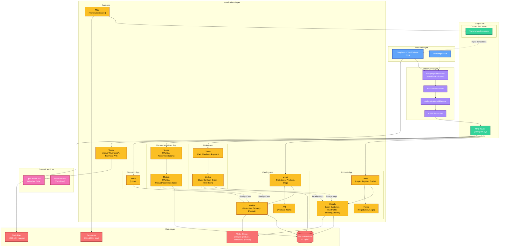

# Urban Loom 🛍️

[](https://www.djangoproject.com/)
[](https://www.python.org/)
[](https://www.docker.com/)
[](LICENSE)

El proyecto consiste en el desarrollo e implementación de **Urban Loom**, una tienda de e-commerce enfocada en moda exclusiva y auténtica. La plataforma permitirá a los usuarios acceder a un catálogo de prendas originales diseñadas por la marca, con funcionalidades clave como navegación intuitiva, carritos de compra, listas de deseos y recomendaciones personalizadas. Además de vender ropa, la propuesta busca construir una **comunidad digital** en torno al estilo y la identidad personal.

## 🚀 Quick Start con Docker

```bash
# 1. Clonar el repositorio
git clone https://github.com/juanrobles05/Urban-Loom.git
cd Urban-Loom

# 2. Configurar variables de entorno
cp .env.example .env
# Editar .env con tus configuraciones

# 3. Levantar con Docker Compose
docker-compose up -d --build

# 4. La aplicación estará disponible en:
# http://localhost:8000
```

**Credenciales por defecto:**
- Email: `admin@urbanloom.com`
- Password: `admin123`

⚠️ **Cambiar en producción!**

## 📚 Documentación Completa

- [📖 Guía de Despliegue](DEPLOYMENT.md) - Instrucciones detalladas de despliegue
- [🐳 Docker Quick Start](DOCKER.md) - Comandos rápidos de Docker
- [🏗️ Arquitectura del Sistema](ARCHITECTURE.md) - Diagramas y arquitectura detallada
- [🔒 Guía de Seguridad](SECURITY.md) - Mejores prácticas de seguridad
- [🧪 Pruebas Unitarias](PRUEBAS_UNITARIAS.md) - Documentación de tests

## Alcance del proyecto
El proyecto abarca:
- **Diseño y desarrollo de la plataforma e-commerce:** con interfaz moderna, adaptable y segura.
- **Implementación de categorías y filtros:** Los cuales faciliten la búsqueda de productos.
- **Módulos de compra:** carrito de compras y sistema de gestión de pedidos.
- **Funciones adicionales:** listas de deseos, historial de compras y recomendaciones personalizadas.
- **Gestión administrativa:** panel de control para el manejo de inventario, clientes y ventas.
- El alcance inicial se enfocará en la **venta en línea nacional**, con proyección a integrar envíos internacionales y nuevas colecciones en fases posteriores.

## Actores involucrados
- **Administradores:** responsables de gestionar el inventario, los pedidos, la atención al cliente y el correcto funcionamiento de la tienda.
- **Clientes:** usuarios finales que interactúan con la plataforma para explorar el catálogo, realizar compras y participar en la comunidad.

## Beneficio de la propuesta
La propuesta genera múltiples beneficios:
- **Para los clientes:** acceso a prendas originales y exclusivas, experiencia de compra ágil, recomendaciones personalizadas y una comunidad que promueve la identidad personal.
- **Para los administradores:** mayor control del negocio, optimización de procesos de venta y fidelización de clientes mediante una plataforma centralizada.

En conclusión, Urban Loom no solo busca ser una tienda de moda en línea, sino también una plataforma innovadora que combine comercio electrónico, experiencia de usuario y comunidad en torno al estilo.

## Estructura de Apps

A continuación se describe el propósito de cada app principal del proyecto:

### 1. accounts
**Gestión de usuarios (clientes y administradores), autenticación, perfiles y direcciones.**
- Modelos: User, Customer, Admin, ShippingAddress
- Formularios: registro, login, edición de perfil, cambio de contraseña
- Vistas: registro, login, logout, perfil, gestión de direcciones
- Templates: login, registro, perfil, gestión de direcciones

### 2. catalog
**Gestión del catálogo de productos y categorías.**
- Modelos: Product, Category
- Vistas: listado de productos, detalle de producto, filtros por categoría, búsqueda
- Templates: listado de productos, detalle de producto, filtros

### 3. orders
**Gestión de pedidos y carrito de compras.**
- Modelos: Order, ShoppingCart
- Vistas: carrito de compras, confirmación de pedido, historial de compras, cancelación de pedido
- Templates: carrito, confirmación, historial de pedidos

### 4. recommendations
**Recomendaciones personalizadas y listas de deseos.**
- Modelos: Recommendation, lista de deseos
- Vistas: mostrar recomendaciones, gestionar lista de deseos
- Templates: recomendaciones, lista de deseos

### 5. storefront
**Interfaz principal de la tienda y páginas públicas.**
- Vistas: home, navegación, páginas informativas, comunidad
- Templates: home, comunidad, contacto, navegación

### 6. core
**Funcionalidades compartidas, utilidades, configuración global.**
- Utilidades: procesadores de contexto, funciones comunes (ej. internacionalización)
- Configuración global

## Diagrama de Arquitectura del Sistema


